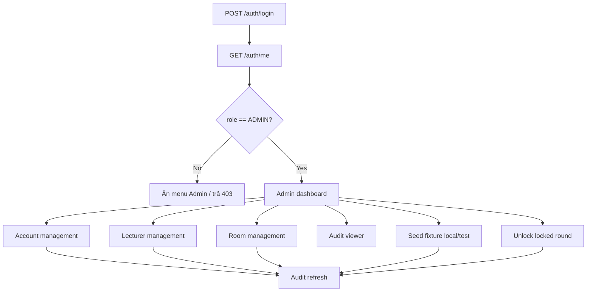

# ADMIN-only API

Tài liệu này chỉ liệt kê các API mà backend hiện tại yêu cầu role `ADMIN` và không cho
`MANAGER`, `LECTURER` hoặc `STUDENT` gọi.

Base URL local:

```text
http://localhost:8000
```

Tất cả endpoint bên dưới đều cần session cookie sau khi login. Các request thay đổi dữ
liệu (`POST`, `PATCH`, `DELETE`) phải gửi thêm:

```http
X-CSRF-Token: <giá trị cookie scheduler_csrf>
Content-Type: application/json
```

Nếu không có quyền, backend trả:

```json
{
  "detail": "Insufficient permission"
}
```

HTTP status là `403`.

## 1. Tổng quan ADMIN-only

| Method | Endpoint | Mục đích |
|---|---|---|
| `GET` | `/api/v1/accounts` | Danh sách account và roles |
| `POST` | `/api/v1/accounts` | Tạo account mới |
| `PATCH` | `/api/v1/accounts/{account_id}/status` | Khóa/mở account |
| `POST` | `/api/v1/accounts/{account_id}/roles` | Thêm role cho account |
| `DELETE` | `/api/v1/accounts/{account_id}/roles/{role}` | Xóa role khỏi account |
| `GET` | `/api/v1/audit` | Tra cứu audit log |
| `POST` | `/api/v1/admin/seed-fixture` | Nạp fixture local/test |
| `POST` | `/api/v1/lecturers` | Tạo lecturer kèm account |
| `POST` | `/api/v1/rooms` | Tạo room |
| `POST` | `/api/v1/rounds/{round_id}/unlock` | Mở khóa round đã `LOCKED` |

> `GET /semesters`, `POST /semesters`, `GET/POST /rounds`, `POST /rounds/{id}/resources`,
> `POST /rounds/{id}/days`, `POST /schedule/run`, `POST /schedule/publish` và reports
> **không phải ADMIN-only**. Các API này hiện cho phép cả `ADMIN` và `MANAGER` hoặc
> nhiều role khác. Xem [role-api-matrix.md](role-api-matrix.md).

## 2. Account management

### 2.1. Liệt kê account

```http
GET /api/v1/accounts
Cookie: scheduler_session=<session>
```

Request không có body và query bắt buộc.

Response `200 OK`:

```json
[
  {
    "id": 1,
    "email": "admin1@gmail.com",
    "display_name": "System Admin 1",
    "status": "ACTIVE",
    "created_at": "2026-08-18T03:00:00+00:00",
    "roles": ["ADMIN"]
  }
]
```

`roles` là mảng vì một account có thể có nhiều system role.

### 2.2. Tạo account

```http
POST /api/v1/accounts
Cookie: scheduler_session=<session>
X-CSRF-Token: <csrf>
Content-Type: application/json
```

Request body:

```json
{
  "email": "manager2@example.com",
  "display_name": "Manager Two",
  "password": "A-strong-password-123",
  "role": "MANAGER"
}
```

Quy tắc:

- `email`: 3–320 ký tự, được trim và lowercase.
- `display_name`: 1–160 ký tự.
- `password`: tối thiểu 12 ký tự.
- `role`: `ADMIN`, `MANAGER`, `LECTURER` hoặc `STUDENT`.

Response `201 Created`:

```json
{
  "id": 25,
  "email": "manager2@example.com",
  "display_name": "Manager Two",
  "role": "MANAGER",
  "status": "ACTIVE"
}
```

Lỗi:

- `409 ACCOUNT_DUPLICATE`: email đã tồn tại.
- `422`: body không hợp lệ.

### 2.3. Cập nhật trạng thái account

```http
PATCH /api/v1/accounts/25/status
Cookie: scheduler_session=<session>
X-CSRF-Token: <csrf>
Content-Type: application/json
```

Request body:

```json
{
  "status": "INACTIVE",
  "reason": "Account owner left the project."
}
```

`status` chỉ nhận `ACTIVE` hoặc `INACTIVE`; `reason` bắt buộc.

Response `200 OK`:

```json
{
  "id": 25,
  "status": "INACTIVE"
}
```

Lỗi chính: `404 ACCOUNT_NOT_FOUND`, `422` nếu thiếu reason hoặc status sai.

### 2.4. Thêm role cho account

```http
POST /api/v1/accounts/25/roles
Cookie: scheduler_session=<session>
X-CSRF-Token: <csrf>
Content-Type: application/json
```

Request body:

```json
{
  "role": "LECTURER",
  "reason": "Account is also a lecturer."
}
```

Response `200 OK`:

```json
{
  "id": 25,
  "role": "LECTURER"
}
```

Nếu role đã có, backend giữ nguyên và vẫn trả kết quả thành công.

### 2.5. Xóa role khỏi account

```http
DELETE /api/v1/accounts/25/roles/LECTURER?reason=Role%20no%20longer%20needed
Cookie: scheduler_session=<session>
X-CSRF-Token: <csrf>
```

`reason` là query parameter bắt buộc, không phải JSON body.

Response `200 OK`:

```json
{
  "id": 25,
  "role": "LECTURER",
  "status": "REMOVED"
}
```

Lỗi chính:

- `404 ACCOUNT_NOT_FOUND`;
- `404 ACCOUNT_ROLE_NOT_FOUND`;
- `422 ACCOUNT_ROLE_INVALID`;
- `422 ACCOUNT_ROLE_LAST` nếu xóa role cuối cùng của account.

## 3. Audit log

### 3.1. Tra cứu audit

```http
GET /api/v1/audit?actor_id=1&action=ACCOUNT_CREATED&entity_type=account&limit=100
Cookie: scheduler_session=<session>
```

Tất cả query parameter đều optional:

| Parameter | Kiểu | Ý nghĩa |
|---|---|---|
| `actor_id` | integer | lọc người thực hiện |
| `action` | string | lọc loại hành động |
| `entity_type` | string | lọc loại entity |
| `limit` | integer | mặc định 100, giới hạn 1–500 |

Response `200 OK`:

```json
[
  {
    "id": 301,
    "actor_id": 1,
    "action": "ACCOUNT_STATUS_CHANGED",
    "entity_type": "account",
    "entity_id": "25",
    "reason": "Account owner left the project.",
    "before_json": {"status": "ACTIVE"},
    "after_json": {"status": "INACTIVE"},
    "occurred_at": "2026-08-18T04:20:00+00:00"
  }
]
```

Audit là dữ liệu chỉ đọc từ API này. Các thao tác account, seed, lecturer, room và unlock
đều ghi audit event tương ứng.

## 4. Seed fixture

API này dành cho local/test hoặc khởi tạo dữ liệu mẫu có kiểm soát, không nên đưa vào
menu nghiệp vụ production.

```http
POST /api/v1/admin/seed-fixture
Cookie: scheduler_session=<session>
X-CSRF-Token: <csrf>
```

Request không có body.

Response `201 Created`:

```json
{
  "fixture": "v1",
  "counts": {
    "version": "v1",
    "lecturers": 2,
    "groups": 1,
    "students": 2,
    "rooms": 2
  }
}
```

Nếu fixture không hợp lệ, trả `422 SEED_INVALID`.

Trong Docker bootstrap, dữ liệu Excel được nạp bởi `db-init`; endpoint này là fixture
API riêng và không thay thế quy trình import Excel.

## 5. Tạo lecturer

> Endpoint này cho phép `ADMIN` và `MANAGER`. `MANAGER` được quản lý lecturer/room phục vụ vận hành lịch; các API account/role hệ thống vẫn chỉ dành cho `ADMIN`.

```http
POST /api/v1/lecturers
Cookie: scheduler_session=<session>
X-CSRF-Token: <csrf>
Content-Type: application/json
```

Request body:

```json
{
  "lecturer_code": "LEC009",
  "email": "lecturer9@example.com",
  "display_name": "Lecturer Nine",
  "password": "A-strong-password-123"
}
```

Backend thực hiện một transaction:

1. Tạo account.
2. Gán system role `LECTURER`.
3. Tạo record `lecturers`.
4. Ghi audit event `MASTER_DATA_CREATED`.

Response `201 Created`:

```json
{
  "id": 9,
  "lecturer_code": "LEC009",
  "account_id": 30
}
```

Lỗi chính:

- `409 DATA_DUPLICATE`: email hoặc lecturer code đã tồn tại.
- `422`: body không hợp lệ.

## 6. Tạo room

```http
POST /api/v1/rooms
Cookie: scheduler_session=<session>
X-CSRF-Token: <csrf>
Content-Type: application/json
```

Request body:

```json
{
  "code": "R009",
  "name": "Defense Room 009",
  "capacity": 30
}
```

Quy tắc:

- `code`: 1–32 ký tự, backend normalize uppercase/trim.
- `name`: 1–160 ký tự.
- `capacity`: lớn hơn 0 và tối đa 500.

Response `201 Created`:

```json
{
  "id": 9,
  "code": "R009",
  "name": "Defense Room 009",
  "capacity": 30,
  "active": true
}
```

Lỗi `409 DATA_DUPLICATE` nếu room code đã tồn tại.

## 7. Unlock round đã khóa

Đây là thao tác đặc quyền để mở một round có status `LOCKED`. Chỉ `ADMIN` được gọi.

```http
POST /api/v1/rounds/12/unlock
Cookie: scheduler_session=<session>
X-CSRF-Token: <csrf>
Content-Type: application/json
```

Request body:

```json
{
  "reason": "Correction approved by academic board."
}
```

Điều kiện:

- Round phải tồn tại.
- Status hiện tại phải là `LOCKED`.
- `reason` bắt buộc.

Backend chuyển trạng thái `LOCKED → COMPLETED` và ghi audit event `ROUND_UNLOCKED`.

Response `200 OK`:

```json
{
  "round_id": 12,
  "status": "COMPLETED"
}
```

Lỗi chính:

- `404 ROUND_NOT_FOUND`;
- `409 ROUND_NOT_LOCKED`;
- `422` nếu reason không hợp lệ.

## 8. Flow màn hình ADMIN



## 9. Axios/fetch mẫu cho FE

```ts
async function adminApi(path: string, init: RequestInit = {}) {
  const csrf = document.cookie
    .split("; ")
    .find((item) => item.startsWith("scheduler_csrf="))
    ?.split("=")[1];

  const response = await fetch(`${API_URL}${path}`, {
    ...init,
    credentials: "include",
    headers: {
      Accept: "application/json",
      "Content-Type": "application/json",
      ...(csrf ? { "X-CSRF-Token": csrf } : {}),
      ...(init.headers ?? {}),
    },
  });

  const data = await response.json();
  if (!response.ok) throw { status: response.status, data };
  return data;
}
```

Admin UI nên invalidate:

```text
create/update account → accounts + audit
add/remove role        → accounts + audit
create lecturer        → lecturers + accounts + audit
create room            → rooms + audit
seed fixture           → accounts + lecturers + students + groups + rooms + audit
unlock round           → rounds + audit
```

