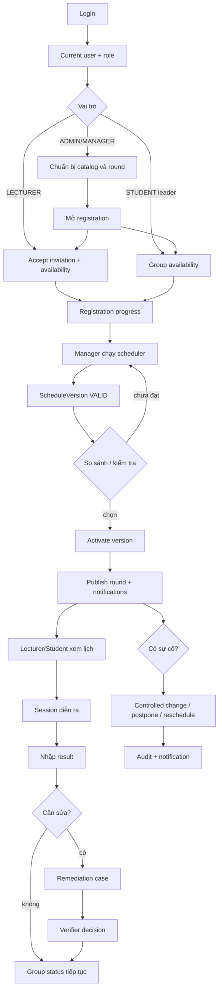
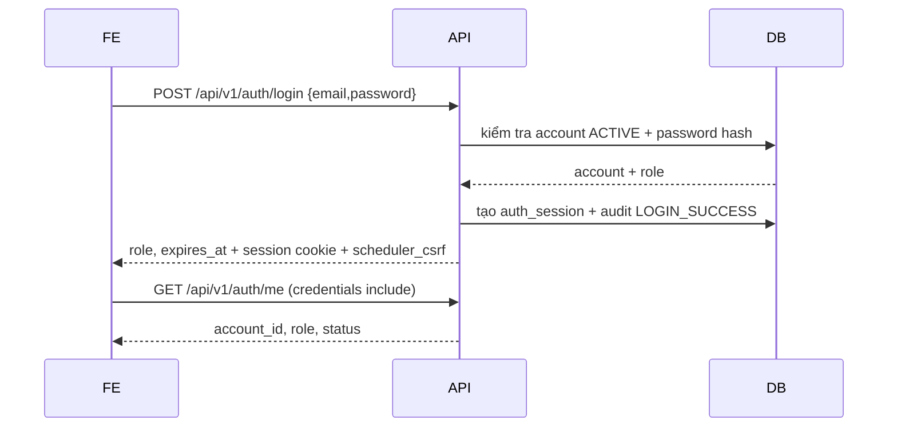
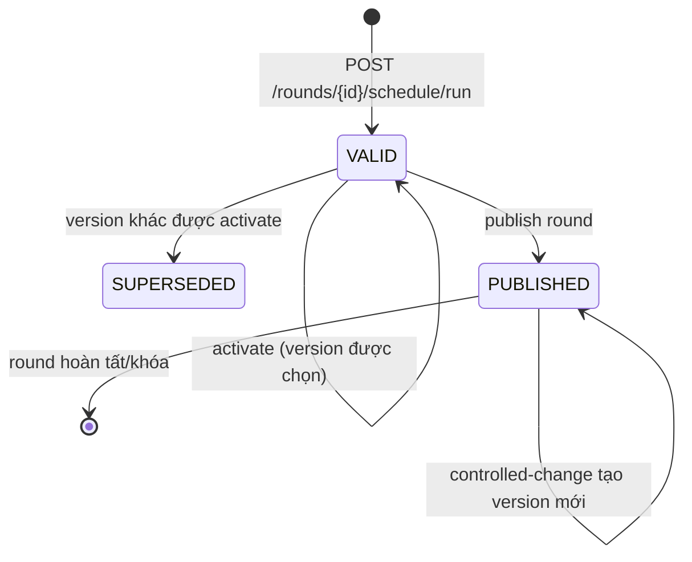
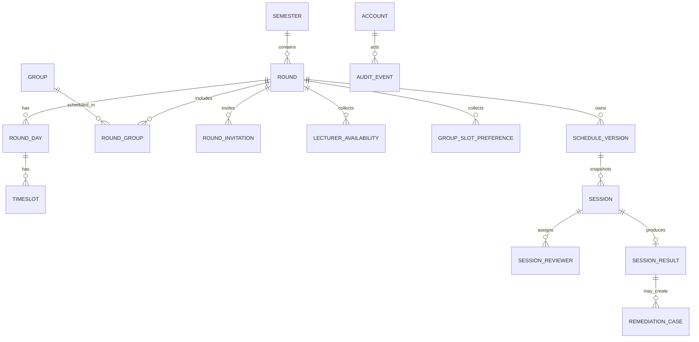
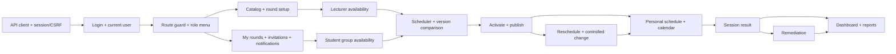

# API architecture và luồng nghiệp vụ

> Tài liệu này là bản chuẩn hóa cách chia API cho Capstone Defense Scheduler.
> Đối chiếu từ route thực tế trong `apps/api/app/routes`, schema/migration, test contract,
> PRD, ERD và business rules hiện có.

## 1. Kết luận thiết kế

API hiện tại không thiếu chức năng chính; vấn đề là một file route đang chứa quá nhiều
ngữ cảnh khác nhau. Ví dụ `master_data.py` đồng thời xử lý tài khoản, master data,
round, đăng ký availability và invitation. Vì vậy frontend khó biết endpoint nào thuộc
luồng nào và khó xây menu/permission.

Đề xuất tổ chức lại theo **domain nghiệp vụ**, nhưng **giữ nguyên URL `/api/v1` hiện tại**.
Đây là một thay đổi về taxonomy và tài liệu, không làm breaking change cho frontend.
Khi cần tách file code, có thể tách router theo đúng nhóm dưới đây mà không đổi path.

### Nguyên tắc

1. API command thay đổi dữ liệu dùng động từ nghiệp vụ (`run`, `publish`, `activate`,
   `transition`, `decision`); API query dùng danh từ và `GET`.
2. `Round` là phạm vi nghiệp vụ; `ScheduleVersion` là một phương án lịch độc lập của
   round; `Session` là một phiên cụ thể trong version.
3. Quyền gồm hai lớp: system role (`ADMIN`, `MANAGER`, `LECTURER`, `STUDENT`) và
   data scope (group, invitation, assignment, result owner, remediation verifier).
4. Mọi thay đổi sau publish phải có `reason`, kiểm tra hard constraint và tạo audit.
5. Non-management không nhận dữ liệu ngoài scope chỉ vì biết được ID.

## 2. Taxonomy API chuẩn

| Domain | Trách nhiệm | Router code nên chứa | URL hiện tại |
|---|---|---|---|
| System/Auth | health, login, logout, current identity, CSRF/session | `system_auth.py` | `/health`, `/api/v1/auth/*`, `/api/v1/me` |
| Account & access | account, role, audit | `account_admin.py` | `/api/v1/accounts*`, `/api/v1/audit` |
| Bootstrap/fixture | local/test fixture bootstrap | `bootstrap.py` | `/api/v1/admin/seed-fixture` |
| Academic catalog | semester, major, student, lecturer, project, group, room | `catalog.py` | `/api/v1/semesters`, `/majors`, `/students`, `/lecturers`, `/projects`, `/groups`, `/rooms` |
| Round setup | tạo round, state, resources, days/slots, H11 waiver | `round_admin.py` | `/api/v1/rounds*`, `/api/v1/rounds/{id}/resources`, `/days`, `transition`, `unlock`, `h11-waiver` |
| Registration | invitation, lecturer availability, group availability, registration progress | `registration.py` | `/api/v1/rounds/{id}/invitations*`, `.../availability`, `registration`, `/my/invitations`, `/my/rounds` |
| Scheduling | run solver, list/detail/activate/publish version | `schedule_versions.py` | `/api/v1/rounds/{id}/schedule/*`, `/api/v1/schedule/versions/*` |
| Schedule operations | edit, controlled change, replacement, postpone, reschedule | `schedule_changes.py` | `/api/v1/schedule/versions/{v}/sessions/*`, `/api/v1/sessions/*`, `/api/v1/reschedule-requests/*`, `/api/v1/rounds/{id}/operation` |
| Results | session result and group status transition | `session_results.py` | `/api/v1/sessions/{id}/result` |
| Remediation | case list, verifier decision, manager overdue decision | `remediation.py` | `/api/v1/remediation*` |
| Read models | dashboard, reports, personal schedule, notifications, iCal | `read_models.py` | `/api/v1/dashboard`, `/reports/*`, `/my/schedule`, `/notifications*`, `/calendar.ics` |

### Mapping module hiện tại sang taxonomy mới

| File hiện tại | Nội dung nên giữ lại sau khi tách |
|---|---|
| `auth_routes.py` | System/Auth |
| `master_data.py` | Tách thành Account & access, Academic catalog, Round setup, Registration |
| `schedule_operations.py` | Tách thành Scheduling và Schedule operations |
| `results.py` | Tách thành Results và Remediation |
| `operations.py` | Read models |

Tách file không bắt buộc phải tách database transaction/service. Mỗi handler vẫn gọi
service domain tương ứng; mục tiêu là một file chỉ có một ngữ cảnh nghiệp vụ.

## 3. Cây API dùng cho frontend

```text
/health                                      system probe
/api/v1
├── auth
│   ├── POST login                            tạo cookie session + CSRF cookie
│   ├── POST logout                           revoke session
│   └── GET  me                               identity hiện tại
├── me                                        alias current identity
├── accounts/*                                ADMIN: account và role
├── audit                                     ADMIN: audit immutable
├── admin/seed-fixture                        ADMIN: local/test fixture only
├── catalog
│   ├── semesters, majors, students
│   ├── lecturers, lecturers/{id}/conflicts
│   ├── projects
│   ├── groups, groups/{id}/leader, .../drop
│   └── rooms
├── rounds
│   ├── GET/POST rounds                        round setup
│   ├── {id}/transition | unlock
│   ├── {id}/resources | days
│   ├── {id}/invitations/*                    registration
│   ├── {id}/lecturers/{lecturer}/availability
│   ├── {id}/groups/{group}/availability
│   ├── {id}/my-availability
│   ├── {id}/registration
│   ├── {id}/schedule/versions                schedule query
│   ├── {id}/schedule/run                    solver command
│   ├── {id}/schedule/publish/{version}
│   └── {id}/operation | .../h11-waiver
├── my
│   ├── rounds
│   ├── invitations
│   └── schedule
├── schedule/versions/{version}
│   ├── GET detail
│   ├── POST activate
│   ├── GET calendar.ics
│   └── sessions/{session}/edit|controlled-change|result-owner
├── sessions/{session}
│   ├── result
│   ├── replacement-suggestions
│   ├── postpone
│   └── reschedule-requests
├── reschedule-requests/{request}/decision
├── remediation/{case}/decision|overdue-fail
├── dashboard, reports/*
└── notifications/{id}/retry
```

Các URL hiện tại chưa có prefix `/catalog`; cây trên là **nhóm logic**, không phải yêu
cầu đổi URL ngay. Nếu phát hành v2, có thể thêm prefix domain và giữ v1 alias.

## 4. Mô hình quyền và data scope

| Role | Được làm | Scope dữ liệu |
|---|---|---|
| `ADMIN` | account, role, audit, master data; các thao tác quản trị | toàn hệ thống |
| `MANAGER` | tạo/cấu hình round, mời người, chạy/chọn/publish lịch, xử lý thay đổi, kết quả/remediation vận hành, reports | toàn round được quản lý |
| `LECTURER` | accept invitation, khai báo availability/conflict, xem session được assign, nhập result khi hợp lệ, verify remediation | invitation, assignment, supervisor hoặc verifier |
| `STUDENT` | xem round của group, leader gửi group availability, xem lịch/kết quả/remediation, gửi reschedule | active group membership; command availability/reschedule chỉ leader |

Role không đủ trả `403`; resource ngoài scope cũng phải trả `403` hoặc `404` theo
contract của endpoint, không được suy ra dữ liệu bằng cách đổi ID.

### Quy tắc identity/session

1. `POST /api/v1/auth/login` nhận `{email,password}`.
2. Backend đặt HttpOnly session cookie và cookie đọc được `scheduler_csrf`.
3. Mọi `POST`, `PATCH`, `DELETE` sau login gửi `X-CSRF-Token` đúng giá trị cookie.
4. Frontend luôn dùng `credentials: "include"`; không dùng Bearer token.
5. `X-Test-Session` chỉ dành cho test environment, không dùng trong FE thật.

## 5. Luồng tổng thể



## 6. Luồng chi tiết theo nghiệp vụ

### 6.1. Đăng nhập và hydrate app



Logout gọi `POST /api/v1/auth/logout`, revoke session và xóa hai cookie.
Login sai nhiều lần có thể trả `429` kèm `Retry-After`.

### 6.2. Manager chuẩn bị một round

1. Đọc semester/major/lecturer/room/project/group.
2. Nếu dữ liệu chưa có: tạo account hoặc master data tương ứng.
3. `POST /api/v1/rounds` với `semester_id`, `type`, `reviewer_count`,
   `session_duration_minutes`, `group_selection_mode`, `result_owner_mode` và H12/soft weights.
4. Gắn nguồn lực bằng `POST /api/v1/rounds/{id}/resources` với group, timeslot, room IDs.
5. Tạo ngày và slot bằng `POST /api/v1/rounds/{id}/days`.
6. Mời lecturer bằng `POST /api/v1/rounds/{id}/invitations`.
7. Chuyển trạng thái `DRAFT -> OPEN_REGISTRATION` bằng `transition`.
8. Theo dõi `GET /api/v1/rounds/{id}/registration` cho tới khi đủ dữ liệu.

Round là aggregate root của registration và schedule. Không chạy solver khi round chưa
có group, slot, room và availability hợp lệ.

### 6.3. Lecturer đăng ký

```mermaid
flowchart LR
    A[GET /my/invitations] --> B{Invitation PENDING?}
    B -->|yes| C[POST invitation/{lecturer_id}/response]
    C --> D[POST lecturer/{id}/availability]
    D --> E[GET /my/rounds + registration]
    B -->|no| E
```

Lecturer chỉ response cho chính mình và chỉ khai báo availability sau khi invitation
được accept. Conflict với project gửi qua
`POST /api/v1/lecturers/{lecturer_id}/conflicts`.

### 6.4. Student “book lịch”

Student không book một session cố định. Student leader gửi **ưu tiên timeslot của
group** để solver dùng làm H10 khi `group_selection_mode=true`.

```http
POST /api/v1/rounds/{round_id}/groups/{group_id}/availability
X-CSRF-Token: <csrf>
Content-Type: application/json

{
  "selected_timeslot_ids": [10, 11],
  "load_preference": "MEDIUM"
}
```

- Chỉ active group leader được gọi.
- `group_id` phải là group mà student đang thuộc.
- Slot phải thuộc round.
- `selected_timeslot_ids: []` có nghĩa là dùng toàn bộ slot của round.
- Nếu round tắt `group_selection_mode`, backend trả lỗi nghiệp vụ thay vì âm thầm ghi
  dữ liệu không được solver sử dụng.
- Xem trước dữ liệu bằng `GET /api/v1/rounds/{round_id}/my-availability`.

### 6.5. Chạy solver và vòng đời ScheduleVersion



`POST /api/v1/rounds/{round_id}/schedule/run` tạo một version mới, không ghi đè version
cũ. Request hiện tại:

```json
{"random_seed": 0, "time_limit_seconds": 10}
```

Mỗi version lưu:

- `version_no`, `round_id`, `status`;
- `input_snapshot`: groups, slots, rooms, availability, constraints và `unscheduled`;
- `algorithm_parameters`, `random_seed`, `solver_status`;
- `total_score`, `soft_scores`;
- `created_by`, `created_at`, `activated_at`;
- các `sessions` và snapshot `session_reviewers`.

`GET /api/v1/rounds/{round_id}/schedule/versions` dùng để so sánh các phương án.
`GET /api/v1/schedule/versions/{version_id}` trả version và sessions; lecturer/student
chỉ thấy sessions trong scope của mình.

Shape rút gọn của version detail:

```json
{
  "id": 12,
  "round_id": 3,
  "version_no": 2,
  "status": "VALID",
  "solver_status": "FEASIBLE",
  "total_score": 91.5,
  "soft_scores": {"S1": 12.0, "S4": 7.5},
  "input_snapshot": {"unscheduled": []},
  "sessions": [
    {
      "id": 101,
      "group_id": 8,
      "timeslot_id": 10,
      "room_id": 2,
      "start_at": "2026-08-20T08:00:00+07:00",
      "end_at": "2026-08-20T08:30:00+07:00",
      "reviewer_ids": [31, 42],
      "result_owner_ids": [],
      "reviewer_names": {"31": "Lecturer A", "42": "Lecturer B"}
    }
  ]
}
```

Frontend không được coi `version_no` là phiên bản duy nhất toàn hệ thống; nó chỉ duy nhất
trong một `round_id`. `status=PUBLISHED` là bản đã công bố, còn `VALID` có thể là bản
được activate trước khi publish.

`POST /api/v1/schedule/versions/{version_id}/activate` chọn version VALID làm phương án
đang dùng. `POST /api/v1/rounds/{round_id}/schedule/publish/{version_id}` công bố
phương án đã chọn và phát notification.

Sau publish, chạy lại toàn bộ solver bị chặn theo PRD. Muốn thay đổi phải dùng controlled
change trên từng session.

### 6.6. Kiểm tra constraint khi sửa lịch

| Tình huống | API | Kết quả |
|---|---|---|
| Sửa version chưa publish | `POST /schedule/versions/{v}/sessions/{s}/edit` | cập nhật nếu hard constraint hợp lệ; lý do bắt buộc |
| Sửa sau publish | `POST /schedule/versions/{v}/sessions/{s}/controlled-change` | tạo record thay đổi, audit và notification |
| Đổi reviewer khẩn cấp | `GET /sessions/{s}/replacement-suggestions` rồi controlled change | chỉ gợi ý lecturer không vi phạm H1-H12 |
| Hoãn một session | `POST /sessions/{s}/postpone` | đổi trạng thái và ghi lý do |
| Hoãn/hủy cả round | `POST /rounds/{id}/operation` | `POSTPONED` hoặc `CANCELLED`, lý do bắt buộc |
| Gỡ H11 cho group | `POST/DELETE /rounds/{id}/groups/{group}/h11-waiver` | manager-only, audit reason |

Hard constraint phải chặn request. Soft constraint có thể cảnh báo nhưng vẫn bắt nhập
reason trước khi lưu theo business rules.

### 6.7. Reschedule request

```mermaid
sequenceDiagram
    participant Actor as Leader/Lecturer
    participant API
    participant Manager
    Actor->>API: POST /sessions/{id}/reschedule-requests {reason}
    API-->>Manager: notification pending
    Manager->>API: POST /reschedule-requests/{id}/decision
    API-->>Actor: APPROVED hoặc REJECTED + note
    API-->>Actor: notification kết quả
```

Request phải thuộc session mà actor được phép thấy. Manager decision nhận
`{"decision":"APPROVED|REJECTED", "note":"..."}`.

### 6.8. Nhập kết quả và remediation

1. Reviewer/result owner gọi `GET /api/v1/sessions/{session_id}/result` để kiểm tra trạng thái.
2. Gọi `POST /api/v1/sessions/{session_id}/result` với outcome, note và dữ liệu remediation
   nếu kết quả cần sửa.
3. Backend kiểm tra round type, reviewer assignment/result-owner mode và session status.
4. Kết quả tạo audit, cập nhật group status và queue notification.
5. Nếu cần sửa, tạo `remediation_case` có due date và verifier.
6. Lecturer verifier gọi `POST /api/v1/remediation/{case_id}/decision`.
7. Nếu quá hạn, Manager gọi `POST /api/v1/remediation/{case_id}/overdue-fail` với reason.

Kết quả của Review 1/2 là cảnh báo, không tự chặn nhóm đi tiếp. Defense và remediation
tuân theo state machine của PRD; không được sửa kết quả đã khóa nếu không có controlled
correction/audit tương ứng.

### 6.9. Đọc lịch, báo cáo và notification

| Nhu cầu | Endpoint | Ghi chú |
|---|---|---|
| Lịch phù hợp role | `GET /api/v1/my/schedule` | có `version_id`, `from_at`, `to_at` |
| Chi tiết version | `GET /api/v1/schedule/versions/{id}` | management toàn bộ; user thường scoped |
| Tải calendar | `GET /api/v1/schedule/versions/{id}/calendar.ics` | response `text/calendar` |
| Notification cá nhân | `GET /api/v1/notifications` | non-management chỉ notification của mình |
| Dashboard | `GET /api/v1/dashboard` | ADMIN/MANAGER |
| Tải lecturer | `GET /api/v1/reports/lecturer-load` | ADMIN/MANAGER |
| Nhóm chưa xếp | `GET /api/v1/reports/unscheduled` | ADMIN/MANAGER |
| Provenance version | `GET /api/v1/reports/provenance/{id}` | scope-aware |
| Chất lượng dữ liệu | `GET /api/v1/reports/quality` | ADMIN/MANAGER |
| Remediation/outcomes | `GET /api/v1/reports/remediation`, `/outcomes` | ADMIN/MANAGER |

## 7. Endpoint matrix theo role

| Nhóm | ADMIN | MANAGER | LECTURER | STUDENT |
|---|---:|---:|---:|---:|
| Auth/current user | ✓ | ✓ | ✓ | ✓ |
| Account/role/audit | ✓ | – | – | – |
| Semester/catalog read | ✓ | ✓ | – | – |
| Tạo/sửa catalog | ✓ | một phần theo route hiện tại | – | – |
| Round setup | ✓ | ✓ | – | – |
| Lecturer invitation/availability | quản lý | quản lý | bản thân | – |
| Group availability | quản lý | quản lý | – | active leader |
| Run/activate/publish schedule | ✓ | ✓ | – | – |
| Xem schedule | toàn bộ | toàn bộ | assigned/supervised scope | active group scope |
| Edit/controlled change | ✓ | ✓ | – | – |
| Reschedule request | quản lý | quản lý | assigned session | group leader |
| Reschedule decision | ✓ | ✓ | – | – |
| Nhập result | vận hành | vận hành | reviewer/result owner | – |
| Remediation verify | – | overdue-fail | assigned verifier | xem |
| Dashboard/reports | ✓ | ✓ | – | – |
| Notifications | toàn management | toàn management | của mình | của mình |

Chi tiết từng URL, body và ví dụ role vẫn nằm ở [role-api-matrix.md](role-api-matrix.md)
và các file API hiện hành. File này là lớp kiến trúc/luồng, không thay thế schema contract.

## 8. Contract request/response và lỗi

### Request

- JSON dùng `Content-Type: application/json`.
- Datetime dùng ISO-8601 có timezone; timezone nghiệp vụ là UTC+7.
- ID là số nguyên dương.
- Code được trim/uppercase ở backend khi domain yêu cầu.
- Command luôn idempotent hoặc trả `409` rõ ràng khi trạng thái không cho phép.

### Response

Không nên ép mọi endpoint vào một envelope giả tạo. Giữ shape hiện tại:

- collection: JSON array;
- detail/command: JSON object;
- calendar: `text/calendar`;
- command tạo resource: `201`;
- command thành công không tạo resource: `200`.

### Status code chuẩn

| Status | Ý nghĩa |
|---:|---|
| `401` | chưa login, session hết hạn hoặc credentials sai |
| `403` | role/scope/CSRF không hợp lệ |
| `404` | resource không tồn tại hoặc không lộ ra ngoài scope |
| `409` | duplicate hoặc state/concurrency conflict |
| `422` | body sai hoặc hard business rule |
| `429` | login throttle |

Lỗi business nên có shape:

```json
{
  "detail": {
    "code": "VERSION_NOT_VALID",
    "message": "Only a valid version can become active."
  }
}
```

## 9. Quan hệ với ERD



Một điểm cần thống nhất giữa tài liệu conceptual và code hiện tại: code dùng
`session_reviewers` để lưu assignment/snapshot của hội đồng; chưa có bảng `councils` độc
lập như một số sơ đồ ERD khái niệm. Tài liệu API nên gọi là `session reviewers` để khớp
runtime hiện tại.

`unscheduled` hiện nằm trong `schedule_versions.input_snapshot`, chưa phải bảng
`unscheduled_groups` riêng. Khi cần filter/report chi tiết, nên tách read model hoặc bảng
con để tránh frontend phải parse JSON snapshot.

## 10. Những điểm cần sửa/chuẩn hóa tiếp theo

### Ưu tiên P0 — không đổi contract

1. Tách `master_data.py`, `schedule_operations.py`, `results.py` theo taxonomy ở mục 2;
   giữ nguyên route decorator và response.
2. Dùng một dependency `require_roles(...)` và một policy `can_access_*` thay cho các
   `_require` lặp lại từng file.
3. Gắn OpenAPI tag theo domain (`auth`, `catalog`, `round-setup`, `registration`,
   `scheduling`, `schedule-operations`, `results`, `remediation`, `reports`).
4. Chuẩn hóa error code và thêm response model cho các endpoint quan trọng.
5. Bổ sung endpoint query rõ ràng cho timeslot của round nếu frontend cần danh sách
   slot độc lập; hiện `my-availability` là endpoint scoped theo user/group.

### Ưu tiên P1 — version API tương lai

Nếu muốn URL phản ánh domain, phát hành `/api/v2` với alias v1 trong một giai đoạn:

| v2 đề xuất | v1 hiện tại |
|---|---|
| `/api/v2/catalog/semesters` | `/api/v1/semesters` |
| `/api/v2/catalog/groups` | `/api/v1/groups` |
| `/api/v2/rounds/{id}/registration/lecturers/{lecturer}/availability` | `/api/v1/rounds/{id}/lecturers/{lecturer}/availability` |
| `/api/v2/rounds/{id}/registration/groups/{group}/availability` | `/api/v1/rounds/{id}/groups/{group}/availability` |
| `/api/v2/rounds/{id}/versions` | `/api/v1/rounds/{id}/schedule/versions` |
| `/api/v2/versions/{version}/sessions/{session}/changes` | `/api/v1/schedule/versions/{version}/sessions/{session}/controlled-change` |
| `/api/v2/rounds/{id}/reports/*` | `/api/v1/reports/*?round_id={id}` |

Không nên đổi URL v1 chỉ để làm đẹp; việc đó tạo chi phí migrate cho frontend nhưng không
giải quyết vấn đề permission nếu policy vẫn phân tán.

## 11. Checklist triển khai frontend

1. Sau login gọi `/api/v1/auth/me`, lưu `role`, `account_id`, `status`.
2. Chọn query key theo aggregate: `round(id)`, `registration(id)`, `versions(id)`,
   `version(versionId)`, `mySchedule(versionId)`, `notifications`.
3. Sau mutation invalidate đúng aggregate:
   - availability → `registration`, `my-availability`;
   - run/activate/publish → `versions`, `version`, `mySchedule`, `dashboard`;
   - controlled change → `version`, `mySchedule`, `notifications`;
   - result/remediation → `result`, `remediation`, `outcomes`, `notifications`.
4. Không render dữ liệu của route management cho lecturer/student chỉ vì endpoint trả
   `200` trong fixture; production phải dựa trên role và scope.
5. Với `409`, reload resource trước khi cho người dùng retry. Với `401`, xóa session UI
   và đưa về login. Với `403`, hiển thị không có quyền hoặc ngoài phạm vi.

## 12. Thứ tự triển khai code frontend

Repo backend hiện không chứa source FE để trace một flow đã có. Vì vậy frontend nên được
viết theo dependency của API, từ authentication đến nghiệp vụ kết quả. Không nên bắt đầu
ở dashboard vì dashboard phụ thuộc vào round, schedule version, session và result.

### 12.1. Thứ tự tổng quát



Thứ tự code cụ thể:

1. **API client nền tảng**: base URL, `credentials: "include"`, JSON parser,
   `X-CSRF-Token`, xử lý `401/403/409/422`.
2. **Authentication**: login, logout, `GET /api/v1/auth/me`, session loading state.
3. **Route guard và layout**: `ADMIN`, `MANAGER`, `LECTURER`, `STUDENT`; menu không
   thay thế backend authorization.
4. **Shared read models**: `GET /api/v1/my/rounds`,
   `GET /api/v1/my/invitations`, `GET /api/v1/notifications`.
5. **Manager catalog**: semester, major, student, lecturer, room, project, group.
6. **Manager round setup**: tạo round, resource, days/timeslots, invitations,
   transition và registration monitoring.
7. **Lecturer registration**: accept invitation, conflict và availability.
8. **Student registration**: xem group availability; active leader gửi availability.
9. **Scheduler workspace**: run, list versions, xem version detail, unscheduled groups,
   soft scores và so sánh phương án.
10. **Activate/publish**: chọn version, xác nhận publish, trạng thái loading và
    notification result.
11. **Schedule consumption**: personal schedule, group schedule, version detail và
    iCalendar export.
12. **Results**: xem/nhập result theo assignment và result-owner rule.
13. **Remediation**: case list, verifier decision, manager overdue-fail.
14. **Schedule operations**: replacement suggestions, edit, controlled change, postpone,
    reschedule request/decision.
15. **Dashboard/reports**: chỉ làm sau khi các read model phía trên ổn định.

### 12.2. Cấu trúc route FE đề xuất

```text
/login
/app
├── /dashboard
├── /notifications
├── /my/rounds
├── /my/invitations
├── /my/schedule
├── /manager/catalog
├── /manager/rounds
├── /manager/rounds/:roundId/registration
├── /manager/rounds/:roundId/schedule
├── /manager/rounds/:roundId/versions/:versionId
├── /manager/reports
├── /lecturer/availability
├── /lecturer/sessions/:sessionId/result
├── /lecturer/remediation
├── /student/availability
├── /student/schedule
└── /student/results
```

### 12.3. Flow code theo role

#### Manager

```text
catalog → create round → resources/days → invitations
→ open registration → monitor registration
→ run scheduler → compare versions → activate → publish
→ dashboard/reports → controlled changes/results operations
```

#### Lecturer

```text
my invitations → accept/decline
→ submit conflicts/availability
→ my schedule → assigned session
→ submit result → verify remediation nếu được assign
```

#### Student

```text
my rounds → chọn round
→ my availability → leader gửi group availability
→ chờ publish → my schedule/group schedule
→ xem result/remediation → gửi reschedule request nếu là leader
```

### 12.4. Query key và invalidation sau mutation

Nên tách cache theo aggregate thay vì cache theo từng màn hình:

```text
currentUser
myRounds
myInvitations
round(roundId)
registration(roundId)
myAvailability(roundId)
scheduleVersions(roundId)
scheduleVersion(versionId)
mySchedule(versionId)
sessionResult(sessionId)
remediation
notifications
dashboard(roundId)
```

| Mutation | Query cần invalidate |
|---|---|
| lecturer/student availability | `registration`, `myAvailability` |
| run scheduler | `scheduleVersions`, `dashboard` |
| activate/publish | `scheduleVersions`, `scheduleVersion`, `mySchedule`, `dashboard`, `notifications` |
| edit/controlled change/postpone | `scheduleVersion`, `mySchedule`, `notifications` |
| submit result | `sessionResult`, `remediation`, `notifications`, `dashboard` |
| remediation decision | `remediation`, `dashboard`, reports liên quan |
| reschedule decision | `mySchedule`, `scheduleVersion`, `notifications` |

### 12.5. Tiêu chí hoàn thành từng phase FE

Mỗi phase chỉ được coi là xong khi có đủ loading, empty, error, permission và success
state. Tối thiểu cần test các case:

- session hết hạn giữa lúc đang ở màn hình;
- user biết ID nhưng không có quyền xem resource;
- student không phải leader gửi availability;
- round chưa đủ dữ liệu chạy scheduler;
- publish version không hợp lệ;
- controlled change thiếu reason hoặc vi phạm hard constraint;
- lecturer nhập result nhưng không phải reviewer/result owner;
- remediation đã được quyết định hoặc đã quá hạn.

## 13. Tiêu chí hoàn thành việc chia lại API

- Mỗi router code chỉ sở hữu một domain ở mục 2.
- OpenAPI tag hiển thị đúng domain và role description.
- Không có handler query dữ liệu ngoài scope của actor.
- Các transition round/version/session được kiểm tra ở service domain, không chỉ ở UI.
- Có test cho: login/CSRF, student leader availability, version lifecycle, publish lock,
  controlled change audit, result/remediation scope.
- `docs/api/README.md` trỏ tới tài liệu này; `role-api-matrix.md` tiếp tục là bảng tra cứu
  endpoint theo role.
